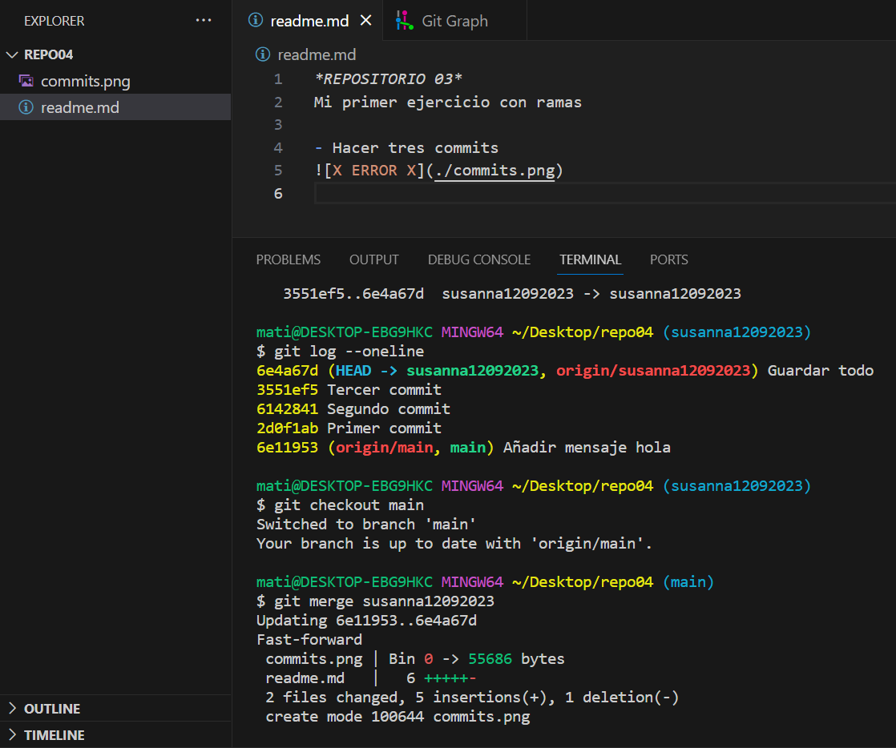
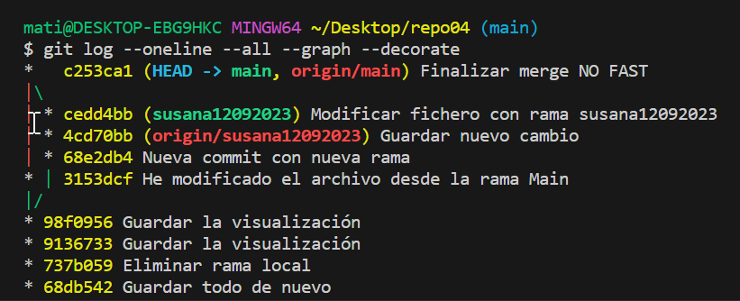

**REPOSITORIO 03**
Mi primer ejercicio con ramas

- Hacer tres commits

- Hacer fusionamiento con merge

- Eliminar la rama en local

- Visualizar el resultado

- Crear rama nueva para hacer nuevos commits

- Modificar con la rama susana12092023

- Estoy en la rama Main

- Hago un merge NO FAST FORWARD

- Hago la visualización de todo

- VISUALIZACIÓN FINAL

